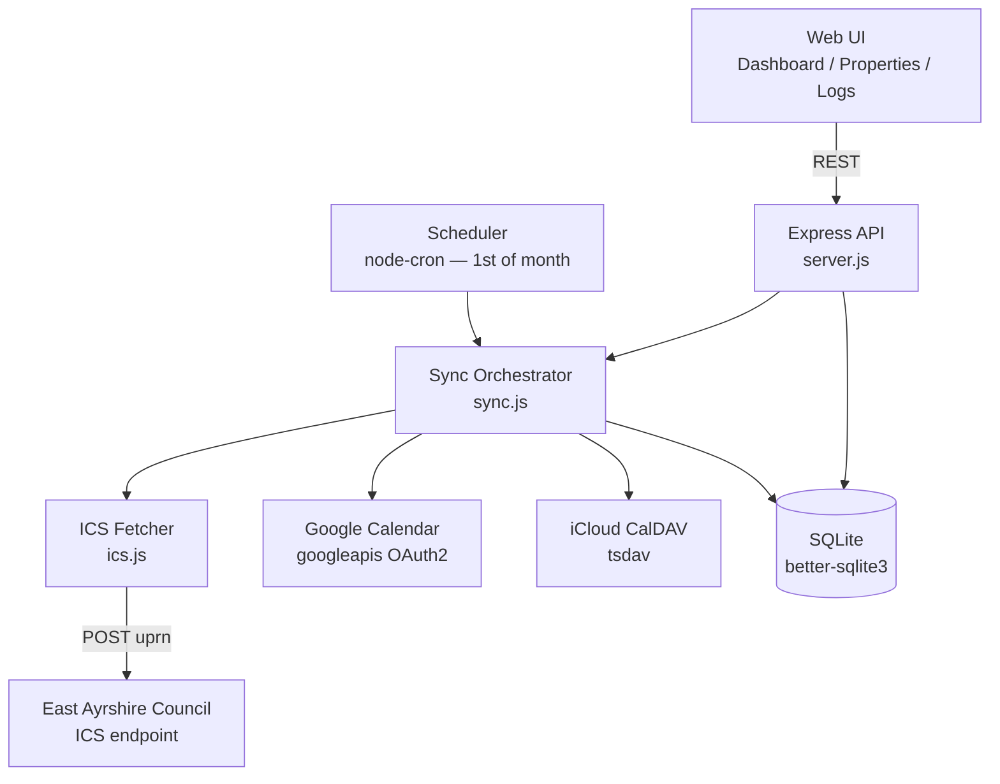

# bin-calendar

A self-hosted Docker application that fetches bin collection schedules from East Ayrshire Council and syncs them to Google Calendar or iCloud. Runs on a Synology NAS. Supports multiple properties, each with its own calendar target.

## Features

- Fetches ICS files from East Ayrshire Council by UPRN
- Syncs to Google Calendar (OAuth2) or iCloud (CalDAV)
- Multiple properties supported — each syncs independently
- Automatic sync on the 1st of each month
- Manual sync via the web UI
- Address/UPRN lookup via getAddress.io (optional)
- Sync history and per-property logs
- Credentials encrypted at rest (AES-256-GCM)

## Architecture



## Requirements

- Docker and Docker Compose
- A Google Cloud project with Calendar API enabled (optional — required for Google Calendar sync)
- An iCloud app-specific password (optional — required for iCloud sync)
- A getAddress.io API key (optional — enables address/UPRN lookup)

## Configuration

Copy `.env.example` and fill in the values:

```bash
cp .env.example .env
```

| Variable | Required | Description |
|---|---|---|
| `ENCRYPTION_KEY` | Yes | 64-character hex string. Generate: `openssl rand -hex 32` |
| `GOOGLE_CLIENT_ID` | For Google | OAuth2 client ID from Google Cloud Console |
| `GOOGLE_CLIENT_SECRET` | For Google | OAuth2 client secret |
| `GOOGLE_REDIRECT_URI` | For Google | Must match the URI whitelisted in Google Cloud Console |
| `GETADDRESS_API_KEY` | Optional | getAddress.io API key for address/UPRN lookup |
| `PORT` | Optional | HTTP port (default: 3000) |

## Deployment (Synology NAS)

1. Generate an encryption key:
   ```bash
   openssl rand -hex 32
   ```

2. Create the data directory:
   ```bash
   mkdir -p /volume1/docker/bin-calendar/data
   ```

3. Pull the image:
   ```bash
   docker pull ghcr.io/alanwaddington/bin-calendar:latest
   ```

4. Create `docker-compose.yml`:
   ```yaml
   services:
     bin-calendar:
       image: ghcr.io/alanwaddington/bin-calendar:latest
       restart: unless-stopped
       ports:
         - "3000:3000"
       volumes:
         - /volume1/docker/bin-calendar/data:/app/data
       environment:
         ENCRYPTION_KEY: <your-64-char-hex-key>
         GOOGLE_CLIENT_ID: <optional>
         GOOGLE_CLIENT_SECRET: <optional>
         GOOGLE_REDIRECT_URI: http://<nas-ip>:3000/auth/google/callback
         GETADDRESS_API_KEY: <optional>
   ```

5. Start:
   ```bash
   docker compose up -d
   ```

6. Open `http://<nas-ip>:3000`

## Development

### Install dependencies

```bash
npm install
```

### Run locally

```bash
ENCRYPTION_KEY=$(openssl rand -hex 32) node src/server.js
```

### Run tests

```bash
npm test
```

Tests run with coverage. The 80% threshold is enforced — the build fails if coverage drops below this on any metric.

### Test structure

```
tests/
├── helpers/
│   └── testDb.js           # In-memory SQLite factory
├── fixtures/
│   └── ics-samples.js      # ICS text samples for parsing tests
├── unit/
│   ├── crypto.test.js
│   ├── ics.test.js
│   ├── uprn.test.js
│   ├── scheduler.test.js
│   └── db.test.js
├── integration/
│   ├── sync.test.js
│   ├── google.test.js
│   └── icloud.test.js
└── api/
    └── server.test.js      # Supertest — all Express routes
```

## CI/CD

GitHub Actions builds and pushes the Docker image to GHCR on every push to `main`. Tests must pass before the image is built.

```
push to main
  └─ test job (npm ci && npm test)
       └─ build job (Docker build & push to ghcr.io)
```

Pull requests also run the test job (no Docker build).

## API

| Method | Path | Description |
|---|---|---|
| GET | `/health` | Health check — returns `{ status, nextSync }` |
| GET | `/api/config` | Feature flags (Google configured, address lookup configured) |
| GET | `/api/properties` | List all properties |
| POST | `/api/properties` | Create a property |
| PUT | `/api/properties/:id` | Update label and UPRN |
| DELETE | `/api/properties/:id` | Delete a property |
| GET | `/api/google/auth-url/:propertyId` | Start Google OAuth flow |
| POST | `/api/google/complete` | Complete Google OAuth (paste callback URL) |
| GET | `/api/google/calendars/:propertyId` | List Google calendars for a property |
| PUT | `/api/properties/:id/calendar` | Set the target calendar |
| POST | `/api/icloud/calendars` | Fetch iCloud calendar list |
| POST | `/api/properties/:id/icloud` | Save iCloud credentials |
| POST | `/api/sync` | Trigger a manual sync |
| GET | `/api/sync/runs` | Sync history |
| GET | `/api/uprn/lookup?postcode=` | Address lookup by postcode |
| GET | `/api/uprn/detail?id=` | Address detail (includes UPRN) |

## Data

SQLite database stored at `/app/data/bin-calendar.db` (volume-mounted on NAS). Migrations run automatically at startup. Sync logs are retained for 90 days.
